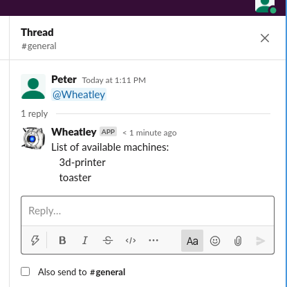
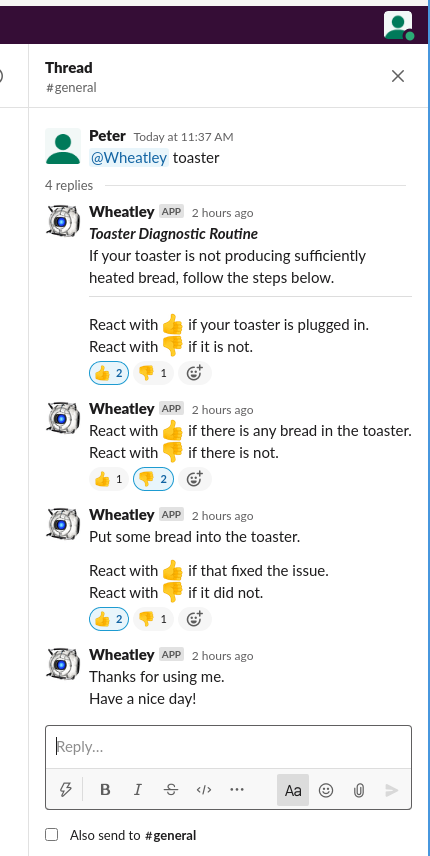
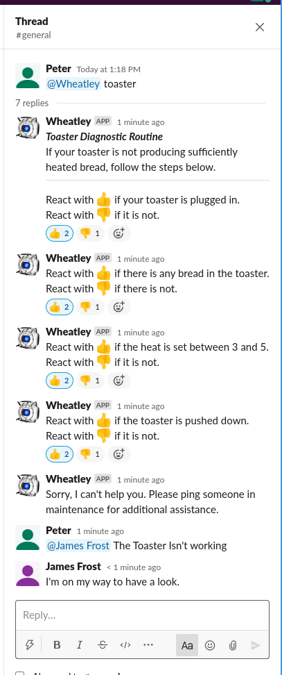

# DMS-Chat

A project for the DMS 2020 Hack

This is a Slack App that aids operators diagnosing problems with machines, etc.
It is built to be extendable, with each diagnosis routine being a simple json file

The project requires node.js to run, with npm also essentially required.

## Features
+ All messages contained within a thread, so will not clutter channels
+ Simple react button
+ Integrates with existing slack setup, so can be used from browsers or mobile phone apps
+ Modular, so adding more machines is a trivial
+ Easy escalation to Maintenance

## Screenshots

### The bot can list available machines it has diagnosis routines for

### Simple Reaction system

### Easy Escalation to a Maintenance Dept.

